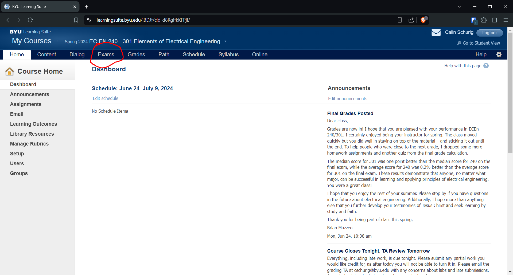
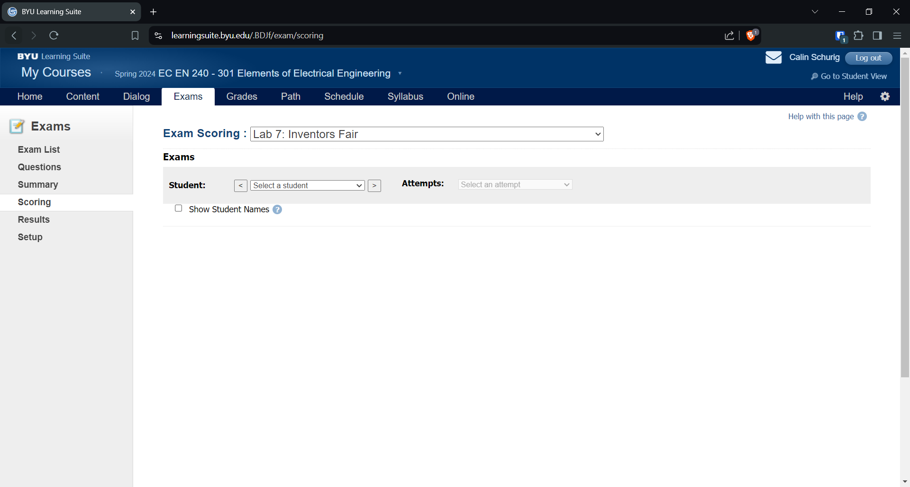

This alternative method to grading does not let you filter by section, but it does let you grade Lab 7, while the other method does not. 

In Learning Suite, click on Exams:

Then hit control+f and search for the lab you want (Lab 7 in this case) and then click score:

Finally, select a student and begin grading! 

