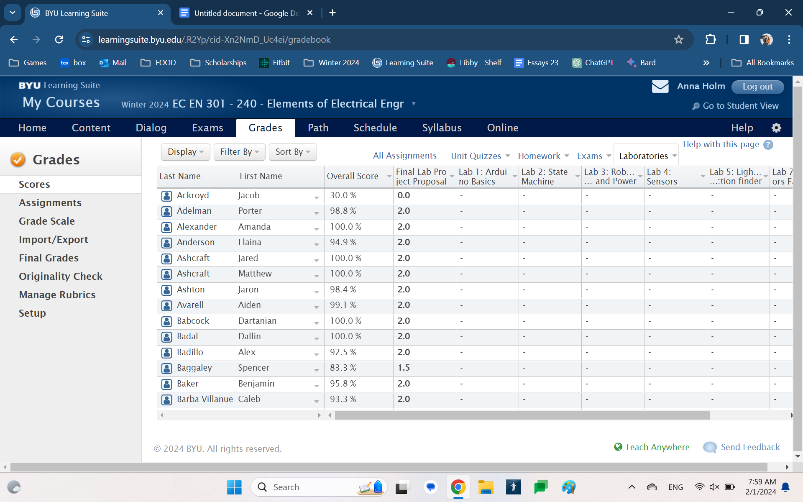
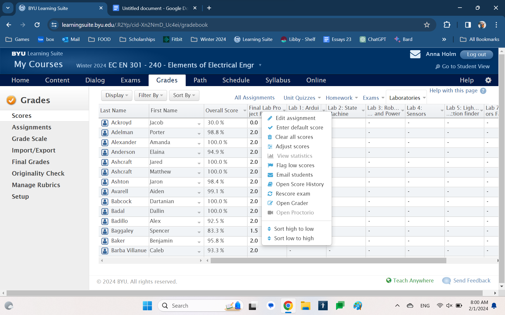
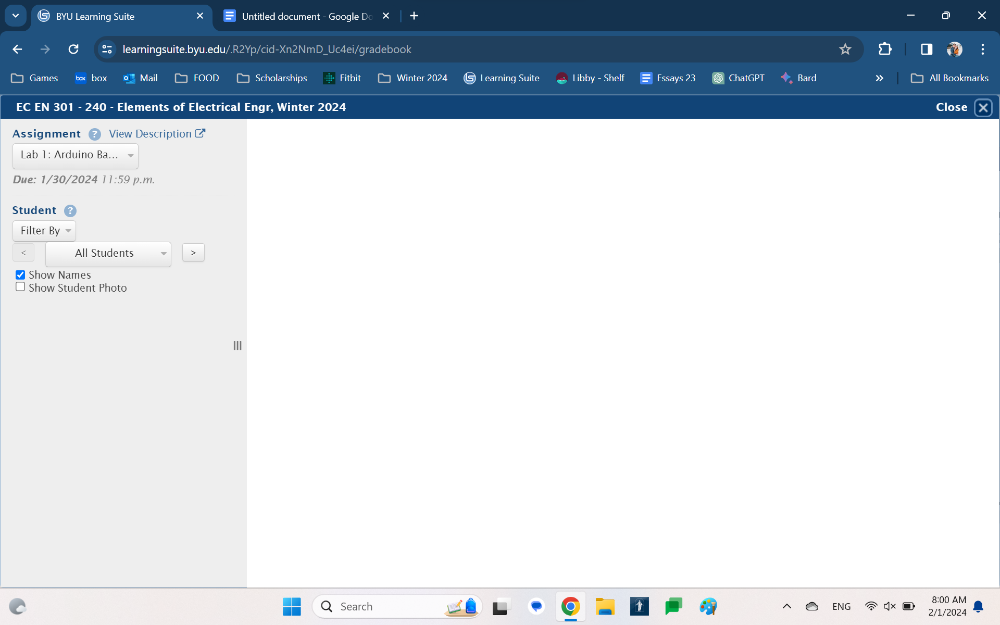
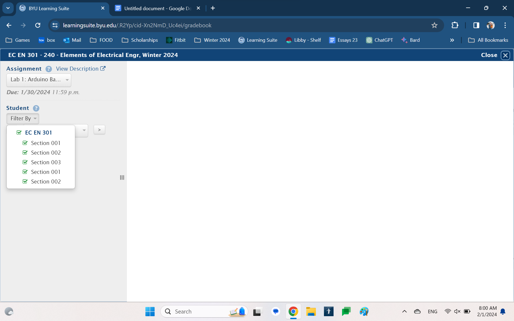

In learning suite, go to grades and select Laboratories:

Then go to Lab 1: Arduino Basics and select “Open Grader”

Select “Filter By”

Select the appropriate section. The first three are 301, the last two are 240.

Click “All Students” and scroll to find the first student in your given section.

Happy grading!
